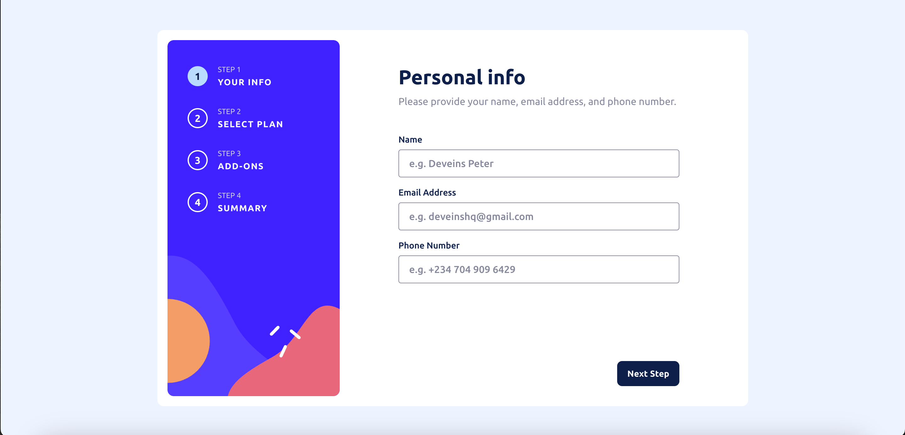
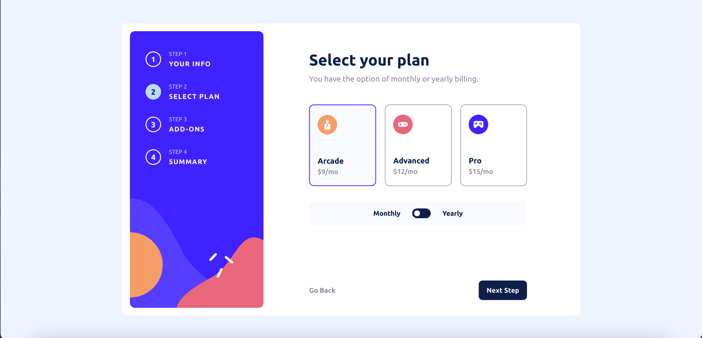
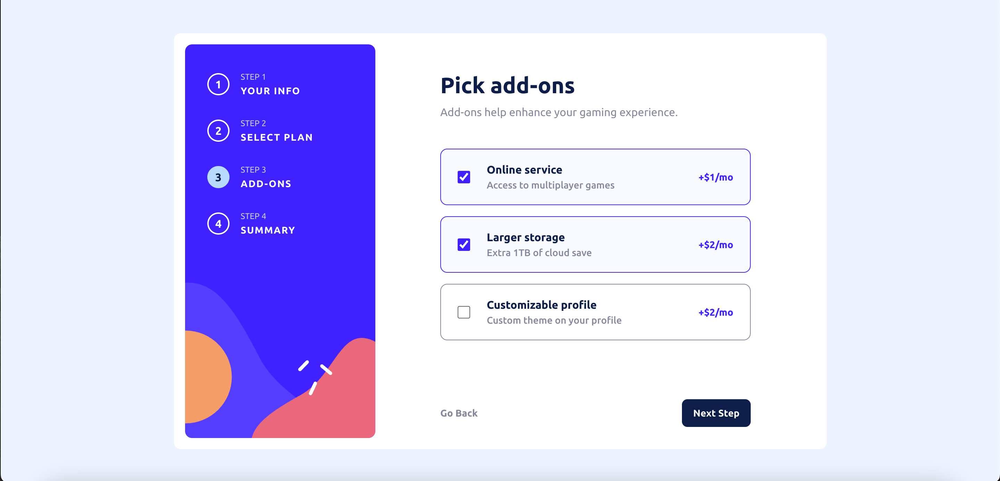
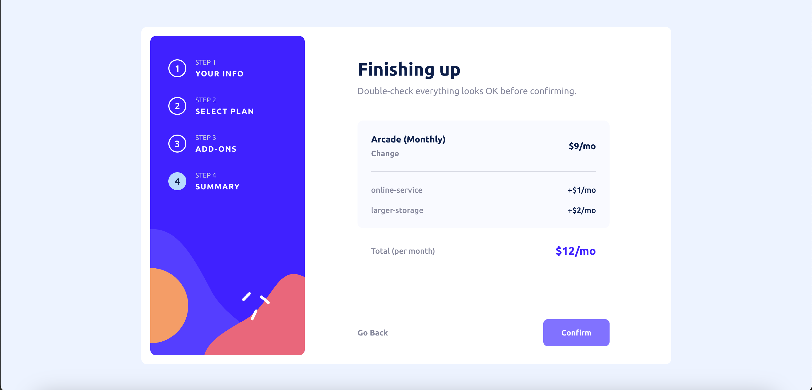
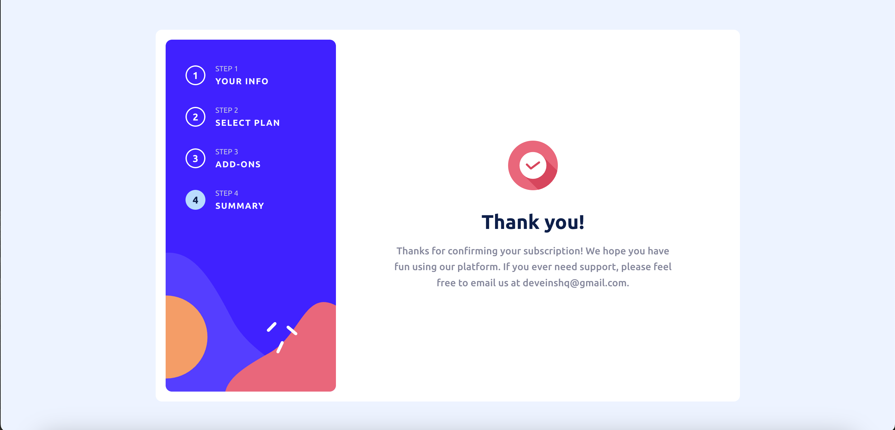

# Multi-Step Form – Frontend Mentor Challenge


A responsive and fully interactive multi-step form built as part of the [Frontend Mentor](https://www.frontendmentor.io/challenges/multistep-form-YVAnSdqQBJ) challenge.  
Built from scratch using semantic HTML, SCSS (BEM methodology), and modular JavaScript.


## 📸 Screenshots

| Step 1 | Step 2 | Step 3 |
|--------|--------|--------|
|  |  |  |

| Step 4 | Step 5 |
|--------|--------|
|  |  |

---

## 🧠 Features

- ✅ Multi-step panel navigation
- ✅ Dynamic form validation (with inline error messages)
- ✅ Custom toggle switch for billing duration (Monthly / Yearly)
- ✅ Plan and add-on selection with real-time data syncing
- ✅ Summary screen with total pricing
- ✅ Animated transitions between steps
- ✅ Mobile-first, fully responsive layout

---

## 💻 Technologies Used

- HTML5 (semantic, accessible)
- SCSS (BEM architecture + responsive mixins)
- JavaScript (modular ES6+)
- Git + GitHub for version control

---

## 📁 Folder Structure

```
multi-step-form/
│
├── index.html
├── scss/
│   ├── abstracts/
│   ├── base/
│   ├── layout/
│   └── components/
├── js/
│   ├── dom.js
│   ├── state.js
│   ├── navigation.js
│   ├── step1.js
│   ├── step2.js
│   ├── step3.js
│   ├── step4.js
│   └── summary.js
├── assets/
│   └── images, icons, fonts
└── README.md
```

---

## ⚙️ Setup Instructions

1. Clone the repository:
   ```bash
   git clone https://github.com/deveins-fem/multi-step-form.git
   ```

2. Navigate into the project:
   ```bash
   cd multi-step-form
   ```

3. Open `index.html` in your browser or use a live server extension.

> No build tools or frameworks required — it’s pure HTML/SCSS/JS.

---

## 🚀 Live Demo

🔗 **Live URL** → [deveins-multi-step-form.netlify.app]](https://deveins-multi-step-form.netlify.app/)

---

## 🔥 Author

**Akinosho Peter Ayomide**  
Frontend Developer & UI Engineer  
📛 [@deveinsHq](https://twitter.com/deveinsHq)  
🌍 Lagos, Nigeria  
📧 deveins.hq@gmail.com

---

## 🏁 Status

✅ Completed — final logic, UI transitions, validation, and summary view all functional.

---

## 🧪 Challenge Link

[Multi-Step Form on Frontend Mentor](https://www.frontendmentor.io/challenges/multistep-form-YVAnSdqQBJ)

---

## 📚 What I Learned

- How to manage multi-step UI with modular JavaScript
- Deep understanding of dynamic form validation
- Working with BEM-based SCSS architecture
- Handling state and DOM sync without frameworks

## 🧠 Reflections

This project was an excellent deep-dive into form UX. It sharpened my skills in planning state, validating input across steps, and keeping the UI responsive and intuitive. I focused on writing clean modular code and designing for scalability.

## 📌 License

This project is open source and free to use under the MIT License.
